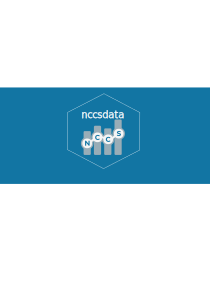

<!-- README.md is generated from README.Rmd. Please edit that file -->

# nccsdata 

<!-- badges: start -->

[](https://github.com/UrbanInstitute/nccsdata/actions/workflows/R-CMD-check.yaml)
[](https://github.com/UrbanInstitute/nccsdata/actions/workflows/test-coverage.yaml)
<!-- badges: end -->

nccsdata provides tools to download, filter, and analyze nonprofit
organization data from the [National Center for Charitable
Statistics](https://nccs.urban.org/) (NCCS). It reads IRS Business
Master File (BMF) data stored as parquet files in a public S3 bucket,
with support for predicate-pushdown filtering by state, county, NTEE
subsector, and exempt organization type.

> **Note:** This is version 2.0.0, a ground-up rewrite of the package.
> The v1 API (`get_data()`, `preview_sample()`, `parse_ntee()`) has been
> replaced. See the [migration section](#migrating-from-v1) below.

## Installation

Install the development version from GitHub:

``` r
# install.packages("devtools")
devtools::install_github("UrbanInstitute/nccsdata")
```

## Usage

### Reading BMF data

`nccs_read()` downloads BMF data from S3 with optional filters.
Filtering happens at the Arrow level via predicate pushdown, so only
matching rows are read into memory.

``` r
library(nccsdata)

# All Pennsylvania nonprofits (default columns)
pa <- nccs_read(state = "PA")

# Arts nonprofits in New York
ny_arts <- nccs_read(state = "NY", ntee_subsector = "ART")

# Select specific columns
pa_slim <- nccs_read(
  state = "PA",
  columns = c("ein", "org_name_display", "geo_county", "income_amount")
)

# Lazy query for custom dplyr pipelines
query <- nccs_read(state = "PA", collect = FALSE)
result <- query |>
  dplyr::filter(geo_county == "Lackawanna County") |>
  dplyr::collect()
```

### Summarizing data

`nccs_summary()` produces grouped count summaries from a collected data
frame.

``` r
pa <- nccs_read(state = "PA")

# Total count
nccs_summary(pa)

# Count by county
nccs_summary(pa, group_by = "geo_county")

# Count by county and subsector, export to CSV
nccs_summary(pa, group_by = c("geo_county", "nteev2_subsector"),
             output_csv = "pa_counts.csv")
```

### Discovering valid filter values

`nccs_catalog()` lists valid values for `nccs_read()` filters without
any network calls.

``` r
nccs_catalog("state")
nccs_catalog("ntee_subsector")
nccs_catalog("exempt_org_type")
```

### Browsing the data dictionary

`nccs_dictionary()` returns a tibble describing all 97 BMF columns, with
optional pattern filtering.

``` r
# All columns
nccs_dictionary()

# Find geocoding-related columns
nccs_dictionary("geo")

# Find NTEE-related columns
nccs_dictionary("ntee")
```

## Migrating from v1

| v1 function                       | v2 replacement                   |
|-----------------------------------|----------------------------------|
| `get_data()`                      | `nccs_read()`                    |
| `preview_sample()`                | `nccs_summary()`                 |
| `ntee_preview()` / `parse_ntee()` | `nccs_catalog("ntee_subsector")` |

Key changes:

- Data source moved from legacy Core/BMF CSVs to geocoded BMF parquet
  files on S3.
- Filtering now uses Arrow predicate pushdown instead of downloading
  full files.
- Dependencies reduced from 12 packages to 3 (`arrow`, `dplyr`,
  `utils`).

## Documentation

Full documentation is available at
<https://urbaninstitute.github.io/nccsdata/>.

## Getting help

- Browse the [getting started
  vignette](https://urbaninstitute.github.io/nccsdata/articles/getting-started.html)
- Open an issue on
  [GitHub](https://github.com/UrbanInstitute/nccsdata/issues)
- Contact the maintainer at `tpoongundranar@urban.org`
