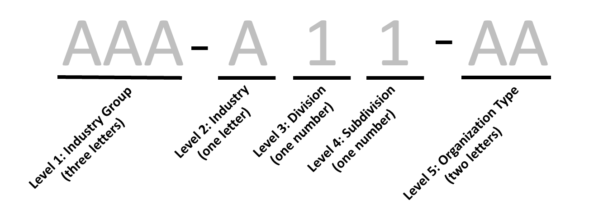

```{r setup, include = FALSE}
knitr::opts_chunk$set(
  collapse = TRUE,
  comment = "#>",
  fig.align = "center"
)
```

## Overview

This vignette demonstrates how the [`nccsdata`](https://urbaninstitute.github.io/nccsdata/) package can be used to
explore and query NTEE codes with the help `ntee_preview()` and `parse_ntee()`.

```{r load-data, message = FALSE, warning = FALSE}
library(nccsdata)
```

## Retrieving NTEE Code Descriptions

The NTEE2 code system is a new code system that builds on the original National
Taxonomy of Exempt Entities (NTEE) code system used by the IRS and NCCS to
classify nonprofit organizations. A comprehensive overview of NTEE codes
is available at [this link](https://github.com/Nonprofit-Open-Data-Collective/mission-taxonomies/blob/main/NTEE-disaggregated/README.md#ntee2-format).

This new NTEE system can be split into 5 levels.



These are grouped into 3 components:

* Level 1: Industry Group
* Level 2-4: Industry, Division and Subdivision
* Level 5: Organization Type

These 3 groups are nested sequentially. And each NTEE2 code must contain all
3 parts in sequence.

`ntee_preview()` provides descriptions for full codes with at least 1 component
included under the `ntee` argument. An example is shown below:

```{r warning = FALSE}
ntee_preview(ntee = "UNI")
```

`ntee_preview()` then prints out the descriptions of all NTEE codes belonging
to the "UNI" (University) Industry Group. The function outputs are nested in the following order:

+ Industry Group (Level 1)
  + Organization Type (Level 5)
    + Industry, Division and Subdivision (Levels 2-4)
    
`ntee` takes arguments belonging to **any** of the 3 components above and 
returns **all** matching NTEE codes.

```{r warning = FALSE}
ntee_preview(ntee = c("UNI", "A25"))
```

You can also preview specific NTEE codes with the `ntee` argument as shown here:

```{r warning = FALSE}
ntee_preview(ntee = c("ART-A61-AA",
                      "ART-A54-MT"))
```

`ntee_preview()` automatically structures the output to avoid repeating
Industry Groups or Organization Types.


For Industry, Division and Subdivision (Level 2-4), `ntee_preview()` accepts
placeholder arguments denoted by the letter `x` (case insensitive). For example, `ntee = B2x` will provide a preview for all NTEE codes with a `B` at Level 2 
and `2` at Level 3. This allows the user to narrow their search to specific
levels. Examples are provided below:

```{r warning = FALSE}
ntee_preview(ntee = "Uxx")
```

```{r warning = FALSE}
ntee_preview(ntee = "H3x")
```

```{r warning = FALSE}
ntee_preview(ntee = "B2x")
```

If you are familiar with each group, `ntee_preview()` offers the following 
arguments:

* `ntee.group`: Industry Group (Level 1)
* `ntee.code` : Industry, Division and Subdivision (Level 2 - 4)
* `ntee.orgtype`: Organization Type (Level 5)

For `ntee.code`, placeholder arguments are supported as well.

```{r warning = FALSE}
ntee_preview(ntee.group = "UNI",
             ntee.code = "Cxx")
```

For any combination of `ntee` arguments, `preview_ntee` returns **all** codes
that fit **any** of the arguments. Thus, in the above example NTEE codes for both
`UNI` and `CXX` were printed out.

## Parse Complete NTEE2 Codes

After understanding what the NTEE codes represent, with `ntee_preview()`, 
`parse_ntee()` can be used to extract complete NTEE codes.

`parse_ntee()` only accepts the following arguments:

* `ntee.group`: Industry Group (Level 1)
* `ntee.code` : Industry, Division and Subdivision (Level 2 - 4)
* `ntee.orgtype`: Organization Type (Level 5)

Use `all` to include all Levels for that specific argument. For example, to
retrieve complete NTEE codes for Universities:

```{r warning = FALSE}
parse_ntee(ntee.group = c("UNI"),
           ntee.code = "all",
           ntee.orgtype = "all")
```

Similar to `ntee_preview()`, `parse_ntee()` accepts placeholder arguments.

```{r warning = FALSE}
parse_ntee(ntee.group = "all",
           ntee.code = "A2x",
           ntee.orgtype = "all")
```


However, `parse_ntee()` only returns NTEE codes that satisfy all arguments.

```{r warning = FALSE}
parse_ntee(ntee.group = "HEL",
           ntee.code = "A2x",
           ntee.orgtype = "all")
```
Since there are no NTEE codes with structure `HEL-A2X-XXX`, `parse_ntee()` does
not return any results.

```{r warning = FALSE}
parse_ntee(ntee.group = c("HEL", "ART"),
           ntee.code = "A2x",
           ntee.orgtype = "all")
```
Including `"ART"` in `ntee.group` returns valid NTEE codes. 
